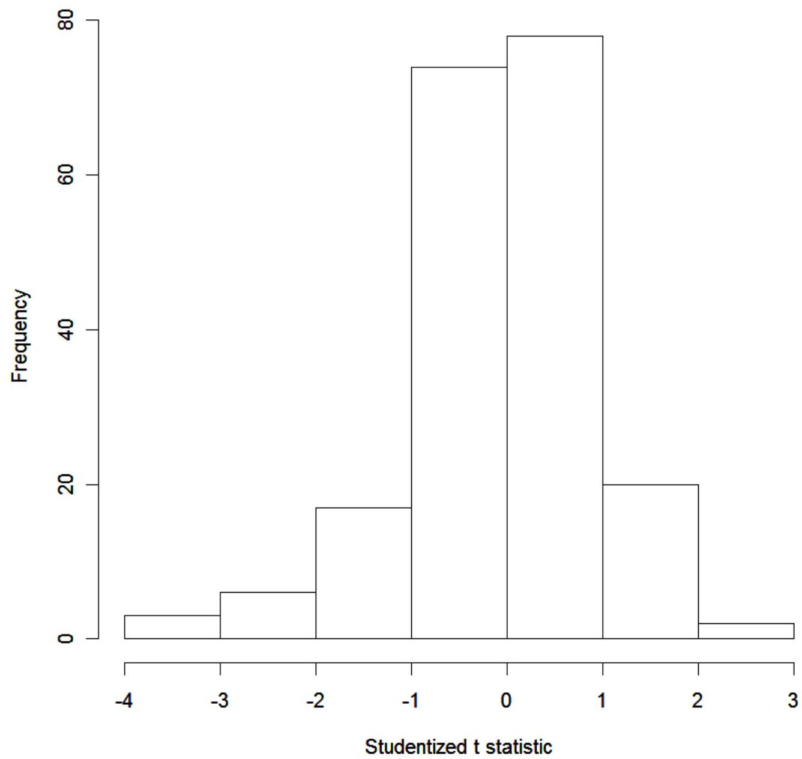

# Bootstrap hypothesis tests

It is possible to use a suitable EBD to create a bootstrap alternative to a classical hypothesis test. The theory about how to choose the test statistic in bootstrap hypothesis test is not simple, so we restrict attention here to a case where the bootstrap test is similar to a well-known test.

Recall the one-sample $\mathrm{t}$ test: a sample $S_{n}=\left\{x_{1}, x_{2}, \ldots, x_{n}\right\}$ is taken at random from a distribution with mean $\mu$. In testing the null hypothesis $H_{0}: \mu=\mu_{0}$, we construct the test statistic

$$
t=\frac{\bar{x}-\mu_{0}}{s / \sqrt{n}}
$$

in which $\bar{x}$ and $s$ are the sample mean and standard deviation respectively. Under the assumption that the data are from a Normal distribution, $t$ follows the $t_{n-1}$ distribution when $H_{0}$ is true. The null hypothesis will be rejected when $t$ is appreciably different from zero. Although this test is quite robust to departures from the assumptions, it may not be justifiable to use this approach when the sample size is small.

There is a bootstrap version of the one-sample t-test. The studentized test statistic is found for each bootstrap sample as follows:

1. Draw a simple random sample with replacement from $S_{n}$.
2. Compute the mean and standard deviation, $\bar{x}^{*}$ and $s^{*}$ from the bootstrap sample.
3. Compute the studentized test statistic

$$
t^{*}=\frac{\bar{x}^{*}-\bar{x}}{s^{*} / \sqrt{n}}
$$

Repeating the above steps $M$ times, the EBD for $t$ is created. Note the difference in the definitions between $t^{*}$ and $t$ : while $t$ is centred on $\mu_{0}, t^{*}$ is centred on $\bar{x}$.

The p-value for this bootstrap test is determined by the EBD and the alternative hypothesis. The cases are as follows:

1. When $H_{a}: \mu \neq \mu_{0}$, the $\mathrm{p}$-value is the proportion of $t^{*}$ values greater than $|t|$ and less than $-|t|$.
2. When $H_{a}: \mu>\mu_{0}$, the $\mathrm{p}$-value is the proportion of $t^{*}$ values greater than $t$.
3. When $H_{a}: \mu<\mu_{0}$, the $\mathrm{p}$-value is the proportion of $t^{*}$ values less than $t$.

**Example**

Recall that Prof Statto is interested in his mean systolic blood pressure. He is worried that his mean blood pressure may have risen to 140 mmHg. In performing a test for the underlying mean, we are testing $H_{0}$ : $\mu=140$ against $H_{a}: \mu<140$. The $t$-test statistic for the sample is

$$
t=\frac{136.50-140}{4.11 / \sqrt{8}}=-2.4086
$$

We can take bootstrap samples from the data and compute the studentized test statistic

$$
t^{*}=\frac{\bar{x}^{*}-136.50}{s^{*} / \sqrt{8}}
$$

and see how many are less than -2.4086 . An empirical bootstrap distribution based on 200 resamples gave four studentized test statistics smaller than -2.4086. The EBD for $t^{*}$ is shown below:

**Histogram of studentized $t$ statistic**

The bootstrap $P$-value for this test is $4 / 200=0.02$, and we would reject at the 5\% significance level the null hypothesis that Prof Statto's mean blood pressure is $140 \mathrm{mmHg}$.

## Bootstrapping in $\mathbf{R}$

A package named bootstrap contains a command for bootstrapping for a statistic from a data set. Once the package is installed, the bootstrap command has the following syntax

    bootstrap(x, nboot, theta)

in which $\mathrm{x}$ contains the data set to be sampled from, nboot is the number of bootstrap samples to be taken, and theta is the statistic to be computed for each sample. The value thetastar gives the nboot bootstrap values of the statistic theta.

Often theta is chosen to be a built-in $\mathrm{R}$ function, such as sd, median and mean. For instance, to resample from a random sample of 100 from the standard Normal distribution, create such a sample in R Cmdr, or else create a vector $\mathrm{x}$ as follows:

    x<- rnorm(100)

(For the rnorm command, the default parameter values are for the standard Normal.) We can create 500 bootstrap samples for the median from $\mathrm{x}$ using

     boot1<- bootstrap(x, 500, median)

This assigns the object to something called boot 1 . We can extract the actual bootstrap sample values by entering

     boot1$thetastar

A histogram of these values can be created by entering

     hist(boot1$thetastar)

The commands sort and quantile can be useful for finding confidence intervals from an EBD. In some cases it may be necessary to define a function for the statistic theta to be computed from each bootstrap sample.

**Example**

 If we enter Prof Statto's blood pressure data into $R$ as the variable "Pressure" in the data set "StattoBlood", the bootstrap $t$ test above can be performed by defining a function as follows:

     tteststat<- function(x){(mean(x)-136.50) /(sd(x)/2.44949)}
    
     results<- bootstrap(StattoBlood$Pressure, 200, tteststat)

A histogram of the results can be created via

    hist(results$thetastar, main = paste ('Histogram of', 'studentized t statistic'), xlab='Studentized t statistic')

