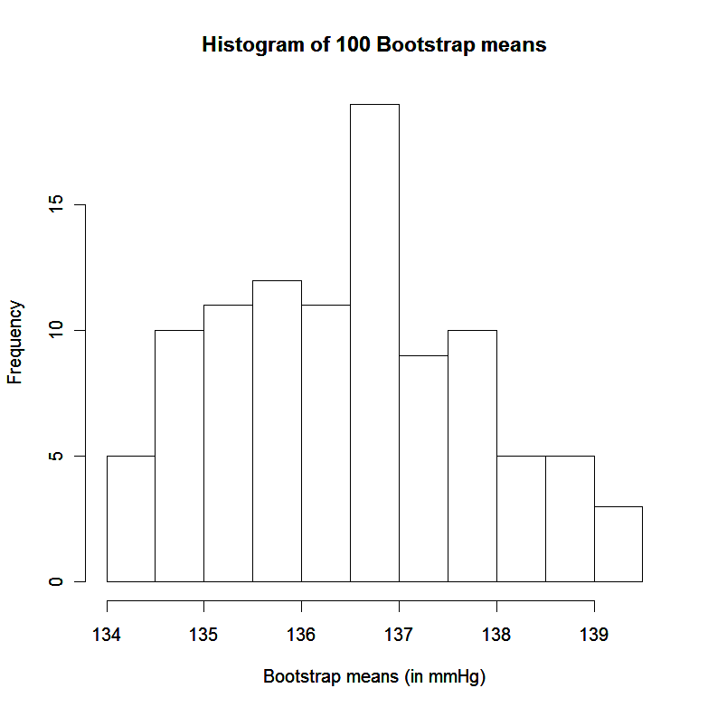

# Bootstrapping 

In some situations it is difficult to make assumptions about the sampling distribution of a statistic. In particular, there may be no obvious way to robustly assess the variance of an estimator.

**Examples:**
 - Prof Statto is concerned about his systolic blood pressure. He has been told by his doctor hypertension is diagnosed when systolic blood pressure reaches $140 \mathrm{mmHg}$. Prof. Statto measures his blood pressure eight times in a day, and observes the following measurements:

$$
\text { 139, 135, 144, 134, 139, 132, 132, } 137
$$

- Sonoda et al. (2011) report experiments involving a remarkable labrador dog, named Marine, that apparently has been trained to detect the presence or absence of bowel and prostate cancer in humans. Samples of breath and faeces were taken from a pool of 48 people with confirmed bowel cancer and 258 disease-free controls. In one study, Marine sniffed five breath samples, only one of which was from a cancer patient. To identify the cancerous sample, she was required to sit in front of it and ignore the others. She did this correctly in 33 out of 36 trials. How accurate is Marine?

- Sniffer dogs in Germany have been trained to detect the presence or absence of lung cancer in humans, including humans without lung cancer but suffering from chronic obstructive pulmonary disease (COPD). The dogs can apparently detect lung cancer in human breath. In part of the study, the dogs were able to detect correctly the absence of cancer 372 times out of 400 subjects who did not have lung cancer. How accurate are these dogs?

## Introducing the bootstrap

Suppose we have a sample of size $n$, which we denote $S_{n}=\left\{x_{1}, x_{2}, \ldots, x_{n}\right\}$. For this sample, let $t$ denote the value of a statistic $T$ of interest. For instance, $t$ could be the sample mean, median or variance. We draw $M$ simple random samples with replacement from $S_{n}$. That is, each observation in a bootstrap sample is taken by picking one of $\left\{x_{1}, x_{2}, \ldots, x_{n}\right\}$ at random, then replacing that observation before selecting the next observation. For each sample selected, the statistic $t$ is found. In this way a set of $M$ values of $T$
are drawn, which we denote $\left\{t_{1}^{*}, t_{2}^{*}, \ldots, t_{M}^{*}\right\}$. These $M$ values comprise the empirical bootstrap distribution (EBD) for $T$.

The empirical bootstrap distribution provides an approximation to the bootstrap distribution, which is the distribution of values of $T$ that would arise if all possible samples with replacement were taken from $S_{n}$. In fact there are

$$
\left(\begin{array}{c}
2 n-1 \\
n
\end{array}\right)
$$

such samples, so it is only feasible to compute the bootstrap distribution for small $n$. As long as $M$ is large, the EBD provides a close approximation to the bootstrap distribution. Computer software can make implementing bootstrapping relatively simple.

**Example:**

Prof Statto is interested in his mean systolic blood pressure. In particular, he wonders whether a 95\% confidence interval for the mean would contain the value $140 \mathrm{mmHg}$. Based on his data, he considers creating a confidence interval using Normal distribution theory and the $t$ distribution, but he recognizes that the approach may be unsound if the data are nonNormal due to the small sample size. Instead he opts for bootstrapping, and resamples from his data one hundred times, computing the mean each time as follows:

|  | 1 | 2 | 3 | 4 | 5 | 6 | 7 | 8 | Mean |
| ---: | ---: | ---: | ---: | ---: | ---: | ---: | ---: | ---: | ---: |
| Sample 1: | 132 | 134 | 135 | 132 | 139 | 132 | 139 | 144 | 135.88 |
| Sample 2: | 139 | 135 | 137 | 132 | 135 | 132 | 132 | 134 | 134.50 |
| $\vdots$ |  |  |  |  |  |  |  |  | $\vdots$ |
|  |  |  |  |  |  |  |  |  |  |
|  |  |  |  |  |  |  |  |  |  |
|  |  |  |  |  |  |  |  |  | $\vdots$ |
| $\vdots$ |  |  |  |  |  |  |  |  | $\vdots$ |
| Sample 100: | 132 | 139 | 132 | 132 | 132 | 144 | 132 | 139 | 135.25 |

Based on the above, the empirical bootstrap distribution for $\bar{x}$ is illustrated by
the histogram below:

The term "bootstrap" was coined by Bradley Efron, to whom the idea is usually attributed. See Efron (1979) for the first paper on bootstrap sampling. The methods we describe here are nonparametric, in that no explicit model is ever assumed for our data. Parametric bootstrapping, where we repeatedly sample from a model, is not discussed, but see Davison and Hinkley (1997) for a fuller description of bootstrapping methods.

## Properties of the EBD

Some general properties of the EBD are summarised below:

1. The EBD is centred on the sample value $t$.
2. The mean of the EBD is an estimate of the mean of the sampling distribution of $T$ over the bootstrap distribution.
3. The standard deviation of the EBD estimates the standard deviation of $T$.
4. For $\alpha \in(0,1)$, the $100 \alpha / 2$ th and $100(1-\alpha / 2)$ th percentile points of the EBD give a 100(1- $\alpha) \%$ bootstrap confidence for the parameter estimated by the statistic $T$.

**Example**

 Prof Statto finds the average of his 100 bootstrap samples is $136.56 \mathrm{mmHg}$, very close to the sample mean of $136.50 \mathrm{mmHg}$. The standard deviation of the means is $1.29 \mathrm{mmHg}$, which is smaller here than the estimated standard deviation of $\bar{x}$ that would be found using

$$
\frac{s}{\sqrt{n}}=\frac{4.11}{\sqrt{8}}=1.45
$$

To obtain a 95\% bootstrap interval for Prof Statto's mean blood pressure, he sorts his 100 bootstrap sample means into order. The $2 \frac{1}{2}$-percentile is taken as the mean of the second and third smallest values, which is $134.19 \mathrm{mmHg}$. Similarly the 971-percentile of the EBD is found by averaging the 97th and 98th in order, which in this case is $139.06 \mathrm{mmHg}$. Hence the $95 \%$ bootstrap interval is $(134.19,139.06)$. This interval does not contain $140 \mathrm{mmHg}$.

The bootstrap approach is most effective when it is difficult to specify the sampling distribution of the statistic $T$. As such, unless we have a very small sample (like in Prof Statto's case), the bootstrap may not be so useful when $T$ is the sample mean. For in that case, sampling theory gives good information about the sampling distribution of $\bar{x}$, and its variance in particular.

**Remark** *When sampling with replacement from a finite population $S_{n}$ of size $n$ with mean $\bar{X}$ and standard deviation $S$, the mean $\bar{x}$ of a sample of size $n$ is unbiased for $\bar{X}$. Moreover, the variance of $\bar{x}$ is*

$$
\operatorname{Var}(\bar{x})=\frac{S^{2}}{n}\left(1-\frac{1}{n}\right) \approx \frac{S^{2}}{n}
$$

*In the case when $S_{n}$ is itself a random sample from some distribution with variance $\sigma^{2}$, then $S^{2}$ is an unbiased estimator of $\sigma^{2}$, and we can conclude that $S^{2} / n$ would be an unbiased estimator of $\sigma^{2} / n$, the variance of $\bar{X}$. So when the variation in the sample mean is of interest, there may be no great benefit from using the bootstrap as long as $n$ is not very small.*

**Example**

Let us return to the example of the dog Marine, who correctly identified the presence of cancer in five breath samples 33 out of 36 times. A simple model for these data takes each trial as Bernoulli variable (1 for success, 0 for failure) with some unknown probability $p$ of success. The total
number of successes would then follow the $B(36, p)$ distribution, assuming independence between each trial. Inference for a Binomial distribution could make use of the Normal approximation, in that the sample proportion $\hat{p}$ approximately follows a Normal distribution:

$$
\hat{p} \sim N\left(p, \sqrt{\frac{p(1-p)}{36}}\right)
$$

The estimate $\hat{p}$ may be used to replace $p$ in the above to construct confidence intervals for $p$. We may be uncomfortable using that approach here though, largely since $p$ is evidently quite close to 1 and the sampling distribution of $\hat{p}$ must be skewed, as $p \in(0,1)$. An alternative approach uses the bootstrap. We can repeatedly sample from the data with replacement, and record the sample proportion for each bootstrap sample.

Suppose we take 200 samples with replacement from the data set. This provides an EBD for $\hat{p}$. We could look at the 5th and 195th values to find a $95 \%$ bootstrap confidence interval for p. In one such bootstrap procedure, the $95 \%$ confidence interval was found to be $(0.806,1.00)$.
