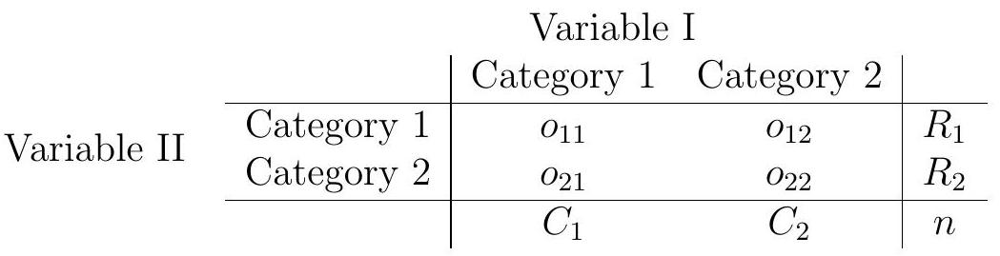

# Fisher's Exact Test

If testing for association (be it either independence or homogeneity) in a $2 \times 2$ table, we may apply a so-called exact test suggested by the famous statistician R.A. Fisher. The test conditions on the marginal totals in the table, that is, the row and column totals, and considers the distribution of the cell counts given those marginal totals. The idea is to examine the "most extreme" tables, with regards to the null hypothesis, that are possible with the same marginal totals, and sum their probabilities. Hence we can find an exact p-value for the table observed by summing the probabilities of the tables at least as inconsistent but having the same marginal totals.

The data in a $2 \times 2$ table are of the form

Given the marginal totals, each possible table is characterized by a single cell count, say $o_{11}$. That is, given the marginal totals and $o_{11}$, we have complete information about the table. In that way we can enumerate the possible tables, and compute their probabilities under the null hypothesis $H_{0}$ of no association between variables I and II. In fact, given the marginal totals, under $H_{0}$, the probability of a given table is

$$
\frac{\left(\begin{array}{c}
C_{1} \\
o_{11}
\end{array}\right)\left(\begin{array}{c}
C_{2} \\
R_{1}-o_{11}
\end{array}\right)}{\left(\begin{array}{c}
n \\
R_{1}
\end{array}\right)}=\frac{R_{1} ! R_{2} ! C_{1} ! C_{2} !}{o_{11} ! o_{12} ! o_{21} ! o_{22} ! n !}
$$

To perform the test, we consider all tables with the same marginal totals as that observed, and compute their probabilities under $H_{0}$ using the above formula. We then consider the set of possible tables at least as unlikely as the one observed, and sum their probabilities. This probability, which includes the probability of the table seen, is the p-value of the test. If suitably small, we may reject the null hypothesis of no association.

## Example
An archaeological survey yielded fifteen urns, each of which had one of two handles, nine had a lip to aid the pouring of liquid. There were six urns with two handles, two of which having a lip. Hence the data can be summarised as follows:

|   |Handles| 1 | 2 | |
|---|-------|-|-|-|
|Lip|      0| 2 | 4 |6|
|   |      1| 7 | 2 |9|
|   |       | 9 | 6 | |

Given the marginal totals, the tables can be characterised by the top left corner entry $o_{11}$, which in this case can take values $0,1, \ldots, 6$. There are seven possible tables with the same marginals:<table cellspacing="0" cellpadding="0" border="0">
    <tr>
        <td>
            <table border="1" cellspacing="0" cellpadding="5">
                <tr>
                    <td>0</td>
                    <td>6</td>
                </tr>
                <tr>
                    <td>9</td>
                    <td>0</td>
                </tr>
            </table>
        </td>
        <td>
            <table border="1" cellspacing="0" cellpadding="5">
                <tr>
                    <td>1</td>
                    <td>5</td>
                </tr>
                <tr>
                    <td>8</td>
                    <td>1</td>
                </tr>
            </table>
        </td>
        <td>
            <table border="1" cellspacing="0" cellpadding="5">
                <tr>
                    <td>2</td>
                    <td>4</td>
                </tr>
                <tr>
                    <td>7</td>
                    <td>2</td>
                </tr>
            </table>
        </td>
    </tr>
    <tr>
        <td>
            <table border="1" cellspacing="0" cellpadding="5">
                <tr>
                    <td>3</td>
                    <td>3</td>
                </tr>
                <tr>
                    <td>6</td>
                    <td>3</td>
                </tr>
            </table>
        </td>
        <td>
            <table border="1" cellspacing="0" cellpadding="5">
                <tr>
                    <td>4</td>
                    <td>2</td>
                </tr>
                <tr>
                    <td>5</td>
                    <td>4</td>
                </tr>
            </table>
        </td>
        <td>
            <table border="1" cellspacing="0" cellpadding="5">
                <tr>
                    <td>5</td>
                    <td>1</td>
                </tr>
                <tr>
                    <td>4</td>
                    <td>5</td>
                </tr>
            </table>
        </td>
    </tr>
    <tr>
        <td colspan="3">
            <table border="1" cellspacing="0" cellpadding="5">
                <tr>
                    <td>6</td>
                    <td>0</td>
                </tr>
                <tr>
                    <td>3</td>
                    <td>6</td>
                </tr>
            </table>
        </td>
    </tr>
</table>

Under the null hypothesis $H_{0}$ of there being no association between presence of a lip and the number of handles, the probability of each table can be found:

$o_{11}$ | $P(o_{11} \mid H_{0})$
--- | ---
0 | 0.0002
1 | 0.0110
2 | 0.1079
3 | 0.3356
4 | 0.3776
5 | 0.1510
6 | 0.0168

For instance,

$$
P\left(o_{11}=2 \mid H_{0}\right)=\frac{\left(\begin{array}{c}
9 \\
2
\end{array}\right)\left(\begin{array}{l}
6 \\
4
\end{array}\right)}{\left(\begin{array}{c}
15 \\
6
\end{array}\right)}=0.1079 .
$$

The tables least likely under the null hypothesis have $o_{11}=0,1$, and $6$ respectively. The table we observe has $o_{11}=2$, and so the p-value for this test statistic is 0.136. Hence there is insufficient evidence against the null hypothesis that there is no association between the presence of lip and the number of handles.

We could of course have performed the Chi-squared goodness-of--fit test here, and come to a similar conclusion (with $\chi^{2}=2.96$ compared to the $\chi_{1}^{2}$ distribution giving a $\mathrm{P}$-value of 0.085). So which test is preferable? Most statisticians would prefer Fisher's exact test for such an example. There are two main reasons: the Chi-squared test can perform poorly when expected counts are small (although in this case a single expected count below 3 is
probably not too serious); moreover, for small overall sample sizes the Chi squared test performs poorly in terms of significance level and power.

Fisher's test is akin to a permutation test, in that it considers all possible ways the test statistic could arise under the null hypothesis. A subtle point arises, given that the test treats the marginal totals as being fixed. Could it be that the marginal totals give information about the likelihood the null hypothesis is true? That is, could conditioning on the marginal totals bias the results? Fisher demonstrated that, for practical purposes, the answers to these questions are both in the negative. There is practically no loss in conditioning on the marginal totals, whether or not they had been fixed in the process that obtained the data.

The R command <code>fisher.test</code> can perform the test. In cases where a one-sided alternative is proposed, only the command-line version of the test can be applied.